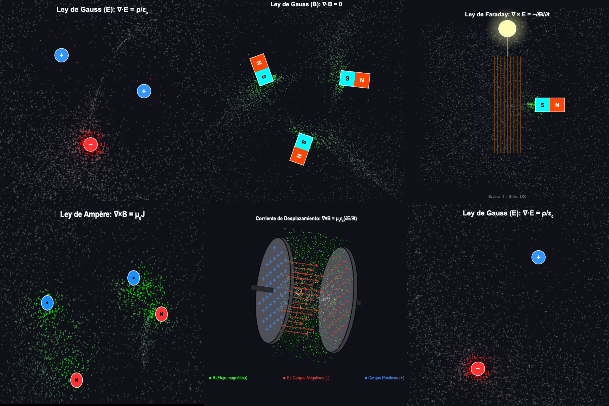

[](https://creativecommons.org/licenses/by-nc-sa/4.0/)

# ⚡ Ecuaciones de Maxwell — Simulaciones Interactivas

> **Maxwell's Equations — Interactive Simulations**

Aplicación web interactiva construida con [Streamlit](https://streamlit.io/) que visualiza las cuatro ecuaciones de Maxwell y sus consecuencias físicas mediante simulaciones en tiempo real renderizadas con Canvas/JavaScript.

*Interactive web application built with [Streamlit](https://streamlit.io/) that visualizes Maxwell's four equations and their physical consequences through real-time simulations rendered with Canvas/JavaScript.*

<p align="center">
  
</p>

---

### 🎮 Pruébalo en vivo / Try it live

[](https://simulacionesmaxwell-gcg.streamlit.app/?embed_options=dark_theme)

Puedes interactuar con las simulaciones directamente en tu navegador sin instalar nada haciendo clic en el botón de arriba o en el siguiente enlace:
[**👉 Ejecutar simulaciones en Streamlit**](https://simulacionesmaxwell-gcg.streamlit.app/?embed_options=dark_theme)

*You can interact with the simulations directly in your browser without installing anything by clicking the button above or the following link:*
[**👉 Play with the simulations on Streamlit**](https://simulacionesmaxwell-gcg.streamlit.app/?embed_options=dark_theme)

---

## 📐 Las Cuatro Ecuaciones / The Four Equations

| # | Ley / Law | Ecuación / Equation | Científico / Scientist |
|---|-----------|---------------------|----------------------|
| I | Ley de Gauss (E) | ∇ · **E** = ρ / ε₀ | Carl Friedrich Gauss (1835) |
| II | Ley de Gauss (B) | ∇ · **B** = 0 | Gauss |
| III | Ley de Ampère-Maxwell | ∇ × **B** = μ₀**J** + μ₀ε₀ ∂**E**/∂t | Ampère (1820) + Maxwell (1865) |
| IV | Ley de Faraday | ∇ × **E** = −∂**B**/∂t | Michael Faraday (1831) |

---

## 🧭 Páginas / Pages

### 1. Ley de Gauss (E) — Gauss's Law (Electric)
Campo eléctrico de cargas puntuales con superposición dinámica. Añade hasta 15 cargas positivas y negativas y observa cómo las líneas de campo se adaptan en tiempo real.

*Electric field from point charges with dynamic superposition. Add up to 15 positive and negative charges and watch field lines adapt in real time.*

### 2. Ley de Gauss (B) — Gauss's Law (Magnetic)
Líneas de campo magnético dipolar. Visualiza cómo los polos N-S siempre forman bucles cerrados, demostrando la inexistencia de monopolos magnéticos.

*Dipole magnetic field lines. Visualize how N-S poles always form closed loops, demonstrating the non-existence of magnetic monopoles.*

### 3. Ley de Ampère-Maxwell — Ampère-Maxwell Law
Dos secciones: **(A)** Corriente de conducción con cables interactivos y **(B)** Corriente de desplazamiento con un capacitor 3D que muestra el campo magnético inducido por ∂**E**/∂t.

*Two sections: **(A)** Conduction current with interactive wires and **(B)** Displacement current with a 3D capacitor showing the magnetic field induced by ∂**E**/∂t.*

### 4. Ley de Faraday — Faraday's Law
Inducción electromagnética con un imán oscilante, bobina de cobre y ampolleta. Más espiras = más voltaje inducido (V = N × |dΦ/dt|).

*Electromagnetic induction with an oscillating magnet, copper coil, and light bulb. More turns = more induced voltage (V = N × |dΦ/dt|).*

### 5. Propagación de Ondas EM — EM Wave Propagation
Tres modos de visualización: **Longitudinal** (flechas 3D de E, B y S), **Plana** (superficie 3D + mapa 2D) y **Radial** (propagación circular desde fuente puntual).

*Three visualization modes: **Longitudinal** (3D arrows of E, B, and S), **Plane** (3D surface + 2D map), and **Radial** (circular propagation from a point source).*

### 6. Circuito Poynting — Poynting Circuit
Flujo de energía electromagnética en un circuito eléctrico con vector de Poynting S = (1/μ₀) **E** × **B**. Incluye 2000 electrones con física determinista que no saltan al encender/apagar.

*Electromagnetic energy flow in an electrical circuit with the Poynting vector S = (1/μ₀) **E** × **B**. Includes 2000 electrons with deterministic physics that don't jump when toggling ON/OFF.*

---

## 🚀 Instalación / Installation

### Requisitos / Requirements
- Python ≥ 3.9
- Streamlit ≥ 1.30

### Pasos / Steps

```bash
# 1. Clonar el repositorio / Clone the repository
git clone https://github.com/<tu-usuario>/maxwell-laws.git
cd maxwell-laws

# 2. Instalar dependencias / Install dependencies
pip install streamlit

# 3. Ejecutar la aplicación / Run the application
streamlit run Home.py
```
---

## 📁 Estructura del Proyecto / Project Structure

```
Maxwell Laws/
├── Home.py                              # Página principal / Main page
├── README.md                            # Este archivo / This file
├── pages/
│   ├── 1_Ley_de_Gauss_E.py             # Gauss (E) — Campo eléctrico
│   ├── 2_Ley_de_Gauss_B.py             # Gauss (B) — Campo magnético
│   ├── 3_Ley_de_Ampere-Maxwell.py      # Ampère + Maxwell
│   ├── 4_Ley_de_Faraday.py             # Faraday — Inducción
│   ├── 5_Propagacion_Ondas_EM.py       # Ondas electromagnéticas
│   └── 6_Circuito_Poynting.py          # Vector de Poynting
```

---

## 🎨 Características Técnicas / Technical Features

- **Renderizado en tiempo real**: Todas las simulaciones usan `<canvas>` de HTML5 con JavaScript vanilla, embebido en Streamlit via `st.components.v1.html()`.
- **Partículas de flujo**: Las simulaciones de campo usan entre 4000–6000 partículas con gradientes de color para visualizar la intensidad del campo.
- **Física determinista**: Los electrones del circuito Poynting usan un generador pseudoaleatorio con semilla fija y posiciones calculadas analíticamente para evitar saltos al cambiar de estado.
- **Proyección 3D**: La onda plana, radial y el capacitor de Maxwell usan un motor de proyección 3D con algoritmo del pintor para el ordenamiento en profundidad.
- **Bilingüe**: Todas las descripciones tienen versión en español (visible) e inglés (en expander colapsado).

*All simulations use HTML5 `<canvas>` with vanilla JavaScript, embedded in Streamlit. Particle systems use 4000–6000 flow particles with color gradients. Deterministic seeded random for electron positions. Bilingual descriptions (Spanish + collapsible English).*

---

## 👤 Autor / Author

**Ph.D Student Giovanni Cocca-Guardia**

🤖 **Asistido por / Assisted by:** Gemini Pro 3.1 & Claude Opus 4.6

🏛️ Escuela de Ingeniería Eléctrica

🏰 Pontificia Universidad Católica de Valparaíso

🇨🇱 Chile 🍷🗿

---

## 📜 Licencia / License

Este proyecto está bajo la licencia [Creative Commons Attribution-NonCommercial-ShareAlike 4.0 International](https://creativecommons.org/licenses/by-nc-sa/4.0/). 
Eres libre de usar, modificar y compartir estas simulaciones con fines educativos y de divulgación, siempre y cuando des el crédito correspondiente, no lo uses con fines comerciales y compartas tus modificaciones bajo esta misma licencia.

*This project is licensed under the [Creative Commons Attribution-NonCommercial-ShareAlike 4.0 International](https://creativecommons.org/licenses/by-nc-sa/4.0/) license. 
You are free to use, modify, and share these simulations for educational and outreach purposes, provided that you give appropriate credit, do not use them for commercial purposes, and distribute your contributions under this same license.*
